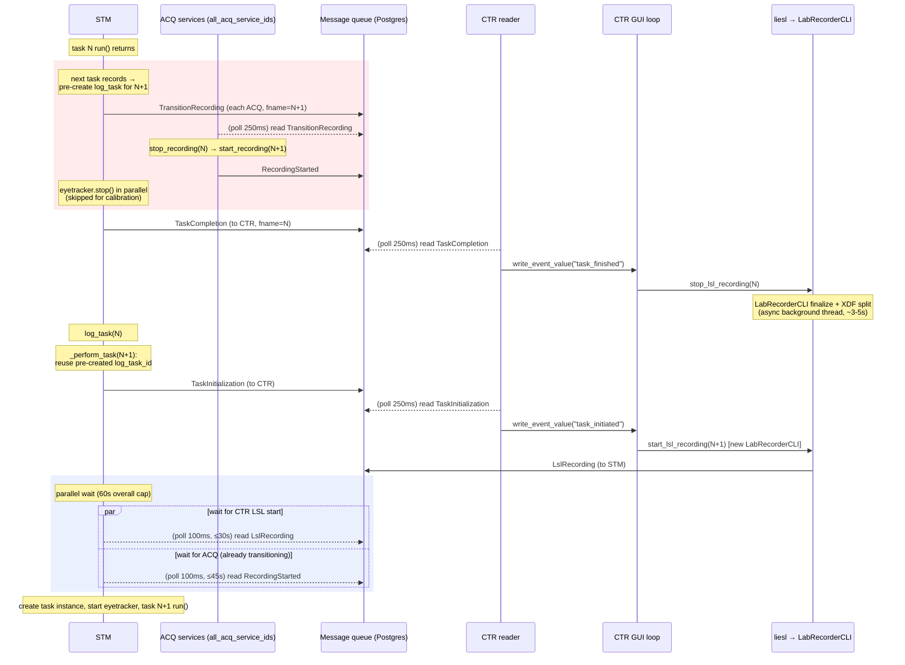

# Inter-Task Message Flow

How the presentation (STM), acquisition (ACQ), and control (CTR) services
coordinate the handoff between task *N* and task *N+1* during a session.

All inter-service messages travel through a **Postgres-backed message queue**:
a sender writes a row; the receiver polls for it on a fixed interval. There is
no direct socket path between services on the recording hot path, so every hop
carries a poll latency of roughly `interval / 2`.

> **Accuracy note.** This document was re-verified against `master` in July 2026
> and every claim carries a `file:line` reference. The code is the source of
> truth — if a reference below has drifted, trust the code and update this doc.
> The dominant path changed materially in mid-2026 (pipelined transitions via
> `TransitionRecording`); an earlier version of this doc described the older
> separate stop-then-start flow.

## Services

| Participant | Role | Message loop |
|---|---|---|
| **STM** | Presentation; runs tasks, orchestrates the transition, blocks on confirmations | `server_stm.py` main loop, 250 ms poll (`server_stm.py:131`) |
| **ACQ** (1..N services) | Acquisition; starts/stops recording devices. Fan-out is dynamic — `config.neurobooth_config.all_acq_service_ids()` (currently ACQ_0 on the ACQ machine, ACQ_1 on the STM machine) | `server_acq.py` main loop, 250 ms poll (`server_acq.py:77`) |
| **CTR message reader** | Background thread; reads STM→CTR messages and raises GUI events | `session_controller.py:_message_reader_loop`, 250 ms poll (`session_controller.py:590-593`) |
| **CTR GUI event loop** | Handles those events; drives LSL recording | wakes immediately via `write_event_value` (`gui.py:901`, `:923`) |
| **CTR LSL recorder** | `liesl.Session` wrapping a **LabRecorderCLI** subprocess | `session_controller.py:481-542` |

## Message catalog

Every message is a `MsgBody` subclass in `neurobooth_os/msg/messages.py`.

| Message | From → To | Purpose |
|---|---|---|
| `TransitionRecording` | STM → each ACQ | Atomically stop the current recording and start the next. ACQ replies `RecordingStarted`. (`messages.py:344`) |
| `StartRecording` | STM → each ACQ | Start recording (fallback / first task). ACQ replies `RecordingStarted`. (`messages.py:323`) |
| `StopRecording` | STM → each ACQ | Stop recording, no follow-on. ACQ replies `RecordingStopped`. (`messages.py:366`) |
| `RecordingStarted` | ACQ → STM | Confirms devices started. (`messages.py:376`) |
| `RecordingStopped` | ACQ → STM | Confirms devices stopped. (`messages.py:386`) |
| `RecordingFiles` | ACQ (and STM for EyeTracker) → CTR | Batch list of files each device created; CTR buckets by `fname` and writes `log_sensor_file` during XDF post-processing. Replaced the fragile `videofiles` LSL marker. (`messages.py:467`) |
| `TaskInitialization` | STM → CTR | Tells CTR to start LSL for the next task. (`messages.py:263`) |
| `LslRecording` | CTR → STM | Confirms LSL recording started. (`messages.py:276`) |
| `TaskCompletion` | STM → CTR | Tells CTR to stop LSL for the finished task (carries `fname`, `has_lsl_stream`). (`messages.py:286`) |

## The pipelined transition (dominant path)

When task *N* records and the immediately-next task *N+1* also records, STM does
**not** stop and later restart ACQ. It issues a single `TransitionRecording` at
the end of task *N*, so ACQ stops *N*'s devices and starts *N+1*'s devices back
to back — eliminating the idle gap on ACQ. ACQ is therefore already recording
*N+1* before STM has even begun `_perform_task` for *N+1*; STM's start-side wait
just collects the `RecordingStarted` confirmation.

Key code:

- STM sends `TransitionRecording` (or `StopRecording` when there is no next
  recording task) in `stop_acq` (`server_stm.py:595-631`); the eyetracker stop
  runs afterward, in parallel, since the ACQ messages are already posted
  (`server_stm.py:633-639`).
- STM pre-creates the next task's `log_task` row so ACQ's `log_sensor_file`
  rows — written at device-start time inside the transition — reference the same
  id (`server_stm.py:333-347`, reused at `:279-281`).
- ACQ handles `TransitionRecording` by stopping then starting devices and
  replying `RecordingStarted` (`server_acq.py:158-180`).
- On the next task, STM's `_start_acq` sees `transition_sent == True` and skips
  sending `StartRecording` — it only waits for the `RecordingStarted` already
  in flight (`server_stm.py:670-671`).

## Fallback path (separate stop / start)

The classic two-message flow still runs when there is no atomic transition to
make:

- **First recording task** of the session, or the task **after a non-recording
  task** (break video, progress bar, coordinator pause) — nothing is recording,
  so STM sends `StartRecording` and waits for `RecordingStarted`
  (`server_stm.py:655-669`).
- **No next recording task** — STM sends `StopRecording`; ACQ replies
  `RecordingStopped` (`server_stm.py:626-629`, `server_acq.py:182-190`).
- **Cancelled transition** (e.g. a recalibration task is injected, so the
  pre-sent `TransitionRecording` was for the wrong task) — STM sends
  `StopRecording` and drains the stale `RecordingStarted` replies
  (`_cancel_transition`, `server_stm.py:575-592`).

## Blocking dependencies, poll intervals, timeouts

STM is the only service that blocks on confirmations. CTR processes
`TaskCompletion`/`TaskInitialization` asynchronously; nobody waits on CTR except
via the `LslRecording` reply.

| STM waits for | From | Poll | Timeout | Code |
|---|---|---|---|---|
| `LslRecording` | CTR | 100 ms | ~30 s (300 attempts) | `server_stm.py:527-530` |
| `RecordingStarted` | each ACQ | 100 ms | 45 s | `server_stm.py:674-685` |
| Both of the above (as a pair) | — | — | 60 s overall | `server_stm.py:302-305` |
| stale `RecordingStarted` drain | each ACQ | 100 ms | 10 s | `server_stm.py:562-572` |

Poll latency per hop = `interval / 2`:

| Loop | Poll | Avg pickup |
|---|---|---|
| STM main loop | 250 ms | ~125 ms |
| STM task-critical waits | 100 ms | ~50 ms |
| ACQ main loop | 250 ms | ~125 ms |
| CTR message reader | 250 ms | ~125 ms |
| CTR GUI event loop | immediate (`write_event_value`) | ~0 ms |

## Where the time goes

STM logs the transition budget on every task with these markers (grep
`log_application`):

- `stop_acq took` — posting the transition/stop to ACQ + eyetracker stop
  (`server_stm.py:349`)
- `Waiting for LSL startup took` — the `LslRecording` wait (`server_stm.py:536`)
- `Waiting for ACQ to start took` — the `RecordingStarted` wait
  (`server_stm.py:689`)
- `Total task WAIT took` — combined startup wait (`server_stm.py:317`)
- `End-to-end transition` — task *N* completion → task *N+1* start
  (`server_stm.py:320`)

For systematic timing, the primitive-level instrumentation lives in the timing
harness (`extras/perf/timing_*`, issue #761; strategy in
`docs/timing_test_strategy.md`), and `extras/perf/intertask_report.py` computes
per-transition gaps from `log_sensor_file`.

## Source map

| Concern | File |
|---|---|
| Message definitions | `neurobooth_os/msg/messages.py` |
| STM orchestration (`_perform_task`, `stop_acq`, `_start_acq`, waits) | `neurobooth_os/server_stm.py` |
| ACQ recording handlers | `neurobooth_os/server_acq.py:139-190` |
| CTR message reader + LSL recording (liesl/LabRecorderCLI) | `neurobooth_os/session_controller.py` |
| CTR GUI event handlers | `neurobooth_os/gui.py:468-475`, `:901-939` |
