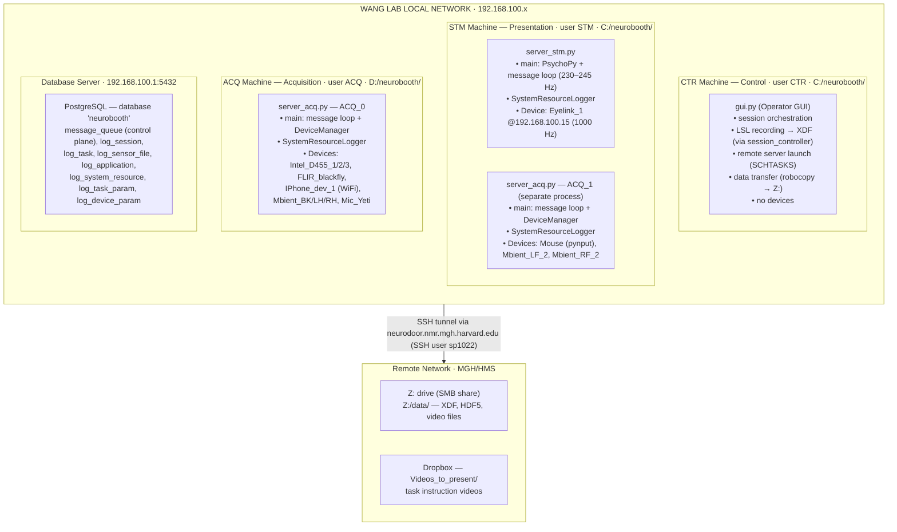

 # Wang Production Deployment: System Diagram

## Physical Machines



## Control Plane: Message Flow

All inter-service coordination goes through the PostgreSQL `message_queue` table.
There are no direct socket connections between machines. For the queue mechanics
see [`messaging_architecture.md`](messaging_architecture.md); for the full
task-to-task choreography see
[`inter_task_message_flow.md`](inter_task_message_flow.md).

```
                    ┌─────────────────────────────────┐
                    │     PostgreSQL message_queue     │
                    │   (priority-ordered, read-once)  │
                    └──┬──────────┬──────────┬─────────┘
                       │          │          │
              ┌────────▼──┐  ┌───▼────┐  ┌──▼──────────┐
              │    CTR     │  │  STM   │  │ ACQ_0/ACQ_1 │
              └────────────┘  └────────┘  └─────────────┘

Session Lifecycle:

  CTR ──PrepareRequest──────────────────────→ STM, ACQ_0, ACQ_1
  CTR ←─SessionPrepared─────────────────────── STM, ACQ_0, ACQ_1

  CTR ──CreateTasksRequest──────────────────→ STM
  CTR ←─TasksCreated────────────────────────── STM

  Per recording task (messages exchanged; see inter_task_message_flow.md):

    CTR ──PerformTaskRequest──────────────────────→ STM
    CTR ←─TaskInitialization──────────────────────── STM
    CTR ──LslRecording  (CTR started LabRecorderCLI)→ STM

    STM ──StartRecording  (first task / after a non-recording task)─→ ACQ_0, ACQ_1
    STM ──TransitionRecording  (atomic stop+start at a task boundary)→ ACQ_0, ACQ_1
    STM ←─RecordingStarted──────────────────────────────────────────── ACQ_0, ACQ_1
    STM ──StopRecording  (final recording task only)────────────────→ ACQ_0, ACQ_1
    STM ←─RecordingStopped  (final recording task only)──────────────── ACQ_0, ACQ_1

    ... task runs on STM (PsychoPy) ...

    CTR ←─TaskCompletion  (CTR stops LabRecorderCLI, splits XDF)──────── STM

  At a task boundary STM sends TransitionRecording (stop current + start next in
  one message) instead of a separate StopRecording/StartRecording pair, so ACQ
  never idles between tasks. StopRecording is used only when no next task records.

  CTR ──TasksFinished───────────────────────→ STM
  CTR ──TerminateServerRequest──────────────→ STM, ACQ_0, ACQ_1
```

## Data Plane: Sensor Streams (LSL)

All sensor data flows via Lab Streaming Layer (LSL) over the local network. CTR records all streams into a single XDF file per task.

```
  ACQ Machine                        STM Machine               CTR Machine
  ═══════════                        ═══════════               ═══════════

  Intel_D455_1 ──30Hz───┐            Eyelink_1 ──1000Hz──┐
  Intel_D455_2 ──30Hz───┤            Marker ─────event────┤
  Intel_D455_3 ──30Hz───┤                                 │
  FLIR_blackfly ─30Hz───┤     ACQ_1 (on STM machine):    │
  IPhone_dev_1 ──30Hz───┤            Mouse ──────50Hz─────┤
  Mbient_BK_1 ──100Hz───┤            Mbient_LF_2 ─100Hz──┤    ┌──────────┐
  Mbient_LH_2 ──100Hz───┼──LSL──────→Mbient_RF_2 ─100Hz──┼───→│ CTR      │
  Mbient_RH_2 ──100Hz───┤                                │    │ records  │
  Mic_Yeti ────48kHz────┘                                 │    │ all to   │
                                                          └───→│ XDF file │
                                                               └──────────┘
```

## Data Storage and Post-Processing Pipeline

`log_sensor_file` rows are written twice: ACQ registers each file's path
directly at device-start time (paths only, NULL timing — keyed by the
`log_task_id` STM passes in `StartRecording`/`TransitionRecording`), and
`split_xdf.py` fills in the timing during post-processing. There is no
file-list message on the bus.

```
  During Session:
  ═══════════════

  ACQ local disk (D:/)          STM local disk (C:/)        CTR local disk (C:/)
  ┌─────────────────┐           ┌─────────────────┐         ┌─────────────────┐
  │ Intel .bag files│           │ Eyelink .edf    │         │ session.xdf     │
  │ FLIR video      │           │ Mouse data      │         │ (all LSL streams│
  │ iPhone data     │           │ Mbient LF/RF    │         │  synchronized)  │
  │ Mbient BK/LH/RH│           │                 │         │                 │
  │ Mic audio       │           │                 │         │                 │
  └────────┬────────┘           └────────┬────────┘         └────────┬────────┘
           │                             │                           │
           └──────────── robocopy ───────┴───────────────────────────┘
                              │
                              ▼
                    Z:/data/<session_folder>/
                    ┌────────────────────────┐
                    │ Raw session data       │
                    │ ├ *.xdf                │
                    │ ├ *.bag (Intel)        │
                    │ ├ *.edf (Eyelink)      │
                    │ ├ *.mp4/.mov (video)   │
                    │ └ sensor data files    │
                    └───────────┬────────────┘
                                │
                      split_xdf.py (async)
                                │
                                ▼
                    ┌────────────────────────┐
                    │ Per-device HDF5 files  │      ┌──────────────────┐
                    │ ├ device_data (timeseries)──→│ log_sensor_file  │
                    │ ├ marker_data (events) │      │ table (metadata) │
                    │ └ video_file refs      │      └──────────────────┘
                    └────────────────────────┘
```

## Device Connection Summary

| Device | Machine | Connection | Sample Rate | Output |
|:--|:--|:--|:--|:--|
| Intel_D455_1/2/3 | ACQ | USB 3.0 | 30 Hz RGB+D | .bag files |
| FLIR_blackfly_1 | ACQ | USB 3.0 | ~30 Hz | video (queue→compress→write) |
| IPhone_dev_1 | ACQ | WiFi | ~30 Hz | streamed frames |
| Mbient_BK/LH/RH | ACQ | BLE | 100 Hz 6-axis IMU | LSL → XDF → HDF5 |
| Mic_Yeti | ACQ | USB audio | 48 kHz | LSL → XDF → HDF5 |
| Eyelink_1 | STM | Ethernet (192.168.100.15) | 1000 Hz | .edf + LSL → XDF |
| Mouse | STM (ACQ_1) | USB/pynput | ~50 Hz event | LSL → XDF → HDF5 |
| Mbient_LF/RF | STM (ACQ_1) | BLE | 100 Hz 6-axis IMU | LSL → XDF → HDF5 |

## Key Observations for Performance Analysis

1. **All control messages transit the database** — message_queue polling adds latency to every task transition. Each StartRecording/TransitionRecording/StopRecording requires a DB round-trip from STM to each ACQ, plus the response.

2. **STM runs 2 processes** that share RAM and CPU: server_stm.py (presentation + Eyelink, with SystemResourceLogger as a background thread) and server_acq.py ACQ_1 (Mouse + foot Mbients, also with its own SystemResourceLogger thread). Each process's SystemResourceLogger thread writes system metrics to `log_system_resource` every 10 seconds.

3. **ACQ handles 9 devices** including 3 USB3 cameras, a FLIR with background compression, 3 BLE Mbients, an iPhone over WiFi, and a USB mic. Peak RAM during recording has been observed above 50 GB.

4. **The Eyelink's 1000 Hz stream** produces the most data per second and requires PsychoPy window access for calibration — this is why it must be on STM. The `edf2asc` ASCII conversion that once dominated each transition (~16 s) is no longer invoked in the recording code path, so the Eyelink stop is now sub-second.

5. **Data transfer happens after session completion** via robocopy to Z: drive. This is network I/O that doesn't affect inter-task timing.
