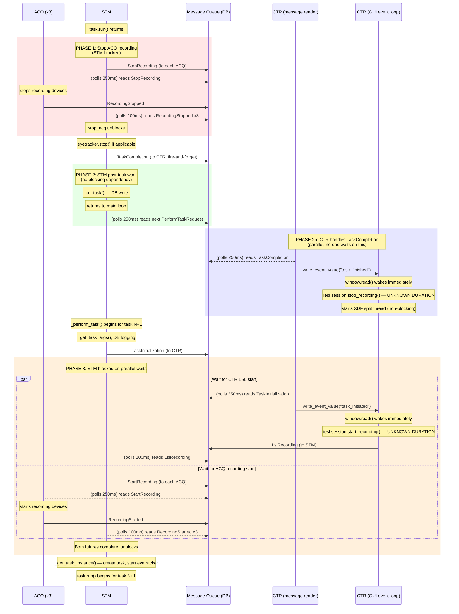

# Inter-Task Message Flow

Messages and processing between the end of task N and the start of task N+1.

## Sequence Diagram



## Blocking Dependencies

| Blocker | Blocked Service | What It Waits For | Poll Interval | Timeout |
|---------|----------------|-------------------|---------------|---------|
| ACQ stop | **STM** | `RecordingStopped` from each ACQ | 100ms | 30s |
| CTR LSL start | **STM** | `LslRecording` from CTR | 100ms | 30s |
| ACQ start | **STM** | `RecordingStarted` from each ACQ | 100ms | **none** |

STM is the only service that blocks on messages. CTR/GUI processes `TaskCompletion`
asynchronously — nobody waits on it.

## Poll Latencies per Hop

Each message goes through the DB queue. The receiver polls at a fixed interval,
so average pickup latency = interval / 2.

| Hop | Direction | Poll Interval | Avg Latency |
|-----|-----------|---------------|-------------|
| STM main loop | any -> STM | 250ms | ~125ms |
| STM task-critical waits | any -> STM | 100ms | ~50ms |
| ACQ main loop | any -> ACQ | 250ms | ~125ms |
| CTR message reader | any -> CTR | 250ms | ~125ms |
| GUI event loop | CTR thread -> GUI | wakes immediately | ~0ms |

## Critical Path (Minimum Latency)

The shortest possible inter-task time, assuming zero processing:

```
stop_acq:
  STM posts StopRecording                          ~0ms
  ACQ polls and picks up             avg  125ms
  ACQ stops devices                       ???
  ACQ posts RecordingStopped               ~0ms
  STM polls and picks up (x3)       avg   50ms
                                    ───────────
                                    min  175ms + device stop time (x3 ACQs)

STM post-task:
  log_task DB write                       ???
  main loop poll for next msg       avg  125ms
                                    ───────────
                                    min  125ms + DB write

start next task (parallel, take the max):
  Path A — CTR LSL start:
    CTR reader polls                avg  125ms
    GUI event loop wakes             ~0ms  (write_event_value wakes window.read)
    liesl start_recording                ???
    CTR posts LslRecording           ~0ms
    STM polls and picks up          avg   50ms
                                    ───────────
                                    min  175ms + liesl start time

  Path B — ACQ recording start:
    ACQ polls and picks up          avg  125ms
    ACQ starts devices                   ???
    ACQ posts RecordingStarted       ~0ms
    STM polls and picks up (x3)     avg   50ms
                                    ───────────
                                    min  175ms + device start time (x3 ACQs)

  task instance creation                 ???

TOTAL MINIMUM (polls only):         ~475ms
TOTAL WITH UNKNOWNS:                ~475ms + device stop + device start
                                          + liesl stop/start + log_task
                                          + task instance creation
```

The "???" items are what the new timing instrumentation will measure.
