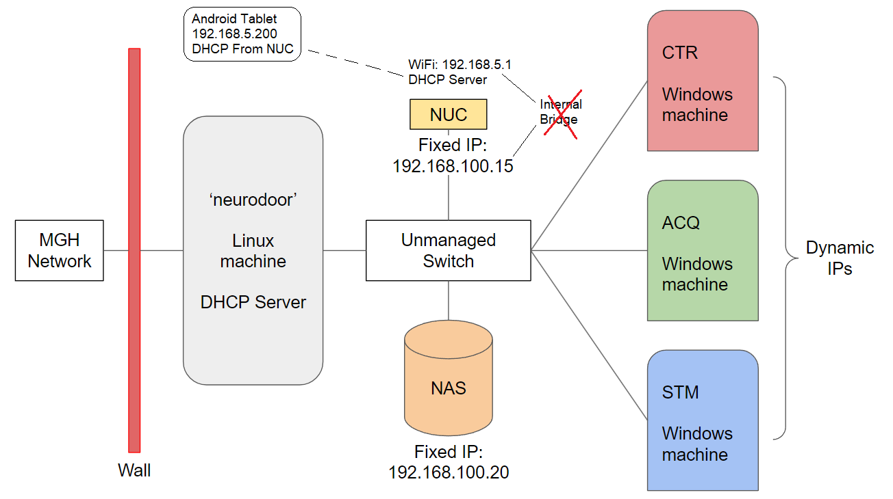
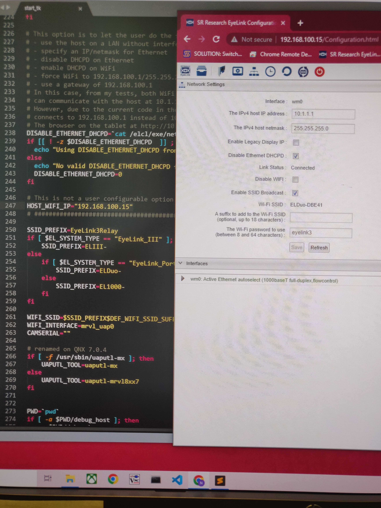
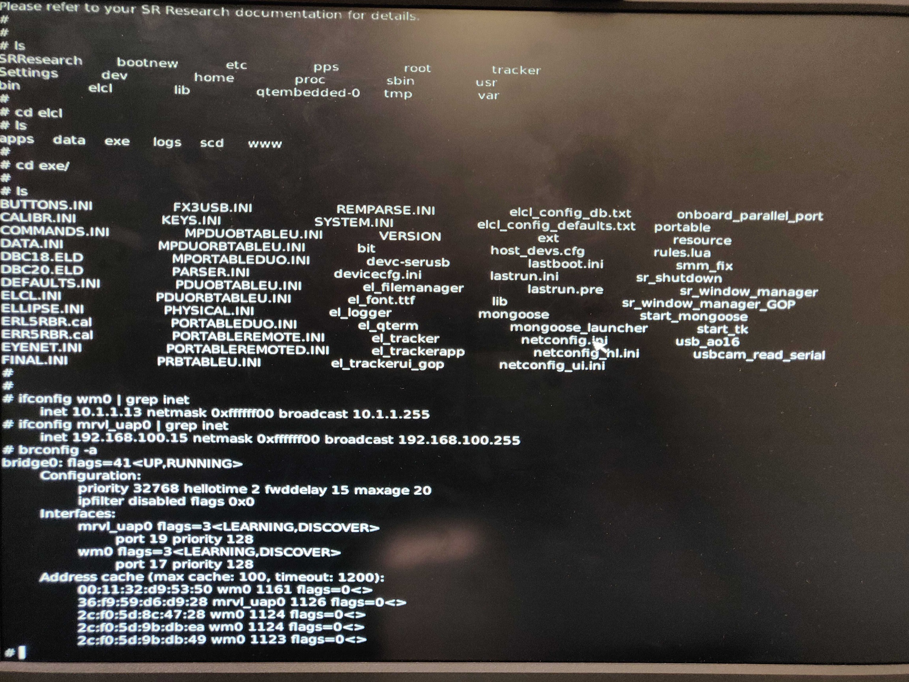
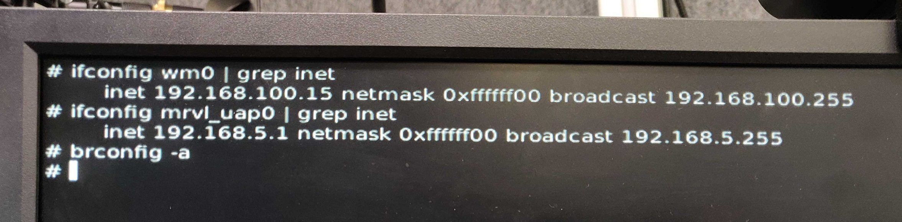

How to setup the network configuration for the Eyelink eyetracker
=================================================================
This doc gives an overview of the network design of the neurobooth and explains how to set up the network configuration on the Eyelink eyetracker NUC so that network communication works correctly.

The Eyelink eyetracker consists of a NUC (which is a small pocket computer), an eyetracking camera, and a tablet with the Eyelink app on it. The NUC broadcasts wifi which the tablet connects to, and the Eyelink app on the tablet can be used to see what the camera is seeing, and hence position the camera, adjust focus etc.

The primary DHCP server on the neurobooth network is a linux machine (neurodoor), which is responsible for assigning IP addresses to other devices on the network, including CTR/ACQ/STM, NAS, and the NUC.

The NUC has two NICs (network interface controllers), one each for WiFi and Ethernet, both of these NICs run a DHCP server on them, and will try to assign IPs to devices connected on the same network as them. Additionally, in the version of eyetracker that we use, there is an internal bridge between the WiFi and Ethernet NIC, such that a communication will be forwarded from one NIC to the other internally. All of these facts mean that there is a direct conflict of the NUC with the DHCP server on neurodoor.

To fix these issues we need to configure the NUC so as to:

1. Disable the DHCP server on the Ethernet NIC
2. Break the internal bridge between the WiFi and Ethernet NIC

The network diagram and the solution can be visualized in the following network diagram:

Steps to set up the EyeLink eyetracker
======================================

Initial Setup
-------------
1. Set up the EyeLink eyetracker as per the user manual
2. You should be able to connect the tablet to the eyetracker and see the camera output in the Eyelink app
3. Tap "Dashboard", and then tap "Connections", the Eyelink app will show you the "Host IP" - this is the IP address of the WiFi NIC on the NUC. You will see the IP as 192.168.100.1 as this is the IP that is configured from the factory. This is a problem because the neurodoor DHCP server is also configured at 192.168.100.1 and there is a direct conflict between the subnets of the two DHCP servers.

Changing the "Host IP" of the NUC's WiFi NIC
--------------------------------------------
1. To change the IP of the WiFi NIC, connect a monitor and keyboard to the NUC, restart the NUC by clicking the "Reboot" option on the tablet, otherwise long press the one physical button on the NUC to power off the NUC, and press it again once to power ON the NUC.
2. When the NUC boots, use the keyboard arrow keys to select the "boot in headless mode" option and press enter - the NUC will boot in the command line interface mode.
3. You can use linux commands to traverse the directory tree, you will be in root, and the relevant files are in the "elcl" folder. Do ``cd /elcl/exe`` and do an ``ls``. You will see a file called ``start_tk``
4. This file runs everytime the NUC boots, and holds the network configuration details for the NUC. Change the HOST_WIFI_IP parameter in line 247 to ``HOST_WIFI_IP="192.168.100.15"`` you can use VI to make this edit in the start_tk file. Save the change and restart the NUC.
5. Check that the host WiFi has changed by opening the Eyelink app on the tablet, and tapping "Connections" to confirm that Host IP value - it should show 192.168.100.15

Disabling Ethernet DHCP server on NUC
-------------------------------------
1. Connect a Windows computer using a LAN cable to an unmanaged switch. When you do an ``ipconfig`` on the Windows machine, you will see an IP in the range 169.254.X.Y, this is the default range that Windows computers use when they are connected to an unmanaged network.
2. Connect the NUC using a LAN cable to the same unmanaged switch. Because the NUC is running a DHCP server (on both its WiFi and Ethernet NICs) the NUC will attempt to assign an IP address to the Windows machine. Confirm that the IP of the Windows machine has changed by running ``ipconfig``, it should be different from 169.254.X.Y. In all likelyhood the IP will be in the range of 10.1.1.X, which is the subnet used by the Ethernet NIC as configured from the factory.
3. In case there is no update in the Windows machine's IP, try a few things:

  * power cycle the switch - OR
  * Take out both cables from the switch, confirm Windows is still on 169.254.X.Y, connect NUC to switch, after a short wait (30s) connect Windows, wait for two minutes then check Windows ip again via ipconfig - OR
  * Do an ``ipconfig /release`` followed by an ``ipconfig /renew`` on Windows - OR
  * Disable the ethernet adapter in Windows, then enable it again after 30s - OR
  * Reboot the NUC - OR
  * Any combination of the above till Windows is assigned an IP by any DHCP server in the NUC

4. In case you see that Windows has an IP in the range of 192.168.100.X - that is also ok, this means that Windows has been assigned an IP by the DHCP server on the WiFi NIC in NUC.
5. Now that Windows has an IP assigned by NUC, you can access the NUC's filesystem via a WebUI that is provided by the NUC. For this open any web browser and put in the IP address of the DHCP server that has assigned IP to the Windows machine - meaning if Windows has a 10.1.1.X IP, type in 10.1.1.1 in the browser, if its 192.168.100.X, type in 192.168.100.15 (remember we set this as host IP in previous step for WiFi NIC) in the browser. This should open the NUC's WebUI.
6. Next, click on the "gear" ICON and go into settings, then click on the "network" icon to open the network configuration page (the icon looks like a tiny flow diagram), this opens the Configuration.html window of the WebUI
7. Tick the "Disable Ethernet DHCPD" check box. Leave all other options as default. This disables the DHCP server running on the Ethernet NIC of the NUC.
8. Repeat all of the steps above, and you will see that Windows now only ever gets a 192.168.100.X IP, because the only DHCP server active in the NUC is on the WiFi NIC. 

An image of line 247 on start_tk and the Configuration.html page of NUC's WebUI is pasted below:

Breaking the Internal Bridge between WiFi and Ethernet NICs inside the NUC
--------------------------------------------------------------------------

As things stand at this point, the Windows machine and the NUC are connected via LAN cables to an unmanaged switch, the DHCP server on the Ethernet NIC has been disabled, and the DHCP server running on the WiFi NIC is assigning an IP address to the Windows machines via the internal bridge between Ethernet and WiFI NICs inside the NUC. Additionally, the Windows machine that is connected only to an Ethernet network, can connect to the WebUI of the NUC by accessing the IP of the WiFi host, again because of the internal bridge.

Before we can break this internal bridge, we need to get the network set up to work with neurodoor. For this:

1. Disconnect NUC and Windows machine from the switch.
2. Check that Windows IP address has reverted to the Windows default of 169.254.X.Y (you can wait/simply restart Windows machine/follow any of the steps above for IP to refresh and revert to Windows default)
3. Connect neurodoor to the switch
4. Connect Windows machine to switch
5. Check and ensure that Windows now has a new IP in the range of 192.168.100.X (since neurodoor's DHCP server is on the 192.168.100.1 subnet)
6. Now, connect NUC to the switch
7. Restart the NUC from the WebUI (keep the monitor and keyboard connected to NUC, and when NUC reboots, select the headless mode to boot into command line interface of the NUC, the WebUI will remain unaffected and will work as normal on the Windows machine)

At this point, we have neurodoor, Windows machine and NUC connected to the switch. Windows has been assigned IP by neurodoor. NUC has a self assigned static IP of 192.168.100.15 as hard coded and configured in the current ``start_tk`` file. Because neurodoor is on the same subnet as NUC WiFi NIC, Windows can successfully access the NUC's WebUI. Additionally, the NUC is booted in headless mode with monitor and keyboard attached.

We can now reconfigure the NUC to break the internal bridge:

1. Go into the elcl/exe directory on NUC and do and ls ``cd /elcl/exe`` | ``ls`` you will see a single ``start_tk`` file
2. To check status of the network configuration on the NUC, run the following commands:
  * ``ifconfig wm0 | grep inet`` output indicates that this NIC (which is the Ethernet one) is configured to broadcast on 10.1.1.255
  * ``ifconfig mrvl_uap0 | grep inet`` output indicates that this NIC (which is the WiFi one) is configured to boradcast on 192.168.100.255
  * ``brconfig -a``output indicates the configuration of the internat bridge between the two NICs
3. The following image shows the NUC's command line interface with these commands and output:

4. Download the ``start_tk_new`` file from this repo onto the desktop of the Windows machine
5. Open the WebUI on the browser by typing 192.168.100.15 in the URL bar
6. Click your way to the /elcl/exe folder, you can list the files by details or tiles, and you will see a single start_tk file here
7. Click the upload button on the WebUI, click browse and select the ``start_tk_new`` file that you downloaded to Desktop, click upload - the file will get uploaded to the NUC in the exe folder
8. Do an ``ls`` in the NUC, and you will see a new file has appeared ``start_tk_new`` in the /elcl/exe folder
9. Rename the original ``start_tk`` file as ``start_tk_orig``
10. Rename the new ``start_tk_new`` file to ``start_tk``
11. Next we need to change the static IP of the Ethernet NIC - for this we need to edit the ``netconfig.ini`` file which is also in the exe folder.
12. Since we are already in the exe folder (confirm by doing pwd) first create a backup of the original netconfig file ``cp netconfig.ini netconfig_orig``, do an ``ls`` and ensure you made the backup
13. Open in VI ``vi netconfig.ini`` and edit the line ``HOST_IP = 10.1.1.1`` to ``HOST_IP = 192.168.100.15`` - side note, this could be done via the Configuration.html page in WebUI, however the WebUI blocks an IP change to 192.168.100.X range since under the existence of the bridge that would conflict with WiFi NIC, therefore we have to do this in the configuration text file.
14. Type ``shutdown`` and hit enter, this will restart the NUC
15. Check status of the network configuration by following commands in step 2 - you should see 192.168.100.255 for Ethernet subnet, a 192.168.5.255 for WiFi subnet and no output for ``brconfig`` as shown below:

16. When the NUC reboots, the WebUI will refresh on its own and you should be able to access NUC's file system at 192.168.100.15. If you goto settings -> network, you will see the Ethernet IP has updated to 192.168.100.15 (from 10.1.1.1)

Explanation
===========
What the new start_tk file ``start_tk_new`` does is it changes the Host WiFi to the 192.168.5.1 subnet. When you check the Host WiFi on the Eyelink app on the tablet, you will now see 192.168.5.1.

Additionally, the new start_tk script breaks the internal bridge between the Ethernet and WiFi NICs. In the absence of the bridge we can no longer connect to NUC's WebUI via the Windows machine, unless the NUC's Ethernet NIC is available on the same subnet. For this we could assign the Ethernet NIC a fixed IP - 192.168.100.15 for example via the DHCP server on neurodoor - we would hard code the mac address of the Ethernet NIC on NUC with the 192.168.100.15 IP address. This type of IP assignment is called as fixed IP assignment since the DHCP on neurodoor will always assign the same fixed IP to a particular mac address (device).

However this type of IP assignment is not supported by the NUC - therefore we set a 'static' IP on the NUC itself by changing the ``netconfig.ini`` file on the NUC. This enables the Ethernet NIC on NUC to always identify itself with the 192.168.100.15 IP. Thus, we need to ensure that the DHCP server on neurodoor is configured to never assign the 192.168.100.15 IP to any device. This can be done either by putting this IP in the "excluded IP" list in the DHCP configuration file - or as is the case now, hard coding the mac address of Ethernet NIC on NUC to this IP (where neurodoor tried to assign fixed IP to NUC, which isn't supported by the NUC, but in the process the IP gets reserved anyway on neurodoor's side).

With this configuration, all Windows machines on the ethernet network can access NUC via the .15 IP address, and the only DHCP server active is neurodoor's. DHCP server on Ethernet NIC on NUC is inactive. And DHCP server on WiFi NIC of NUC is active and managing communication with the tablet.

END
